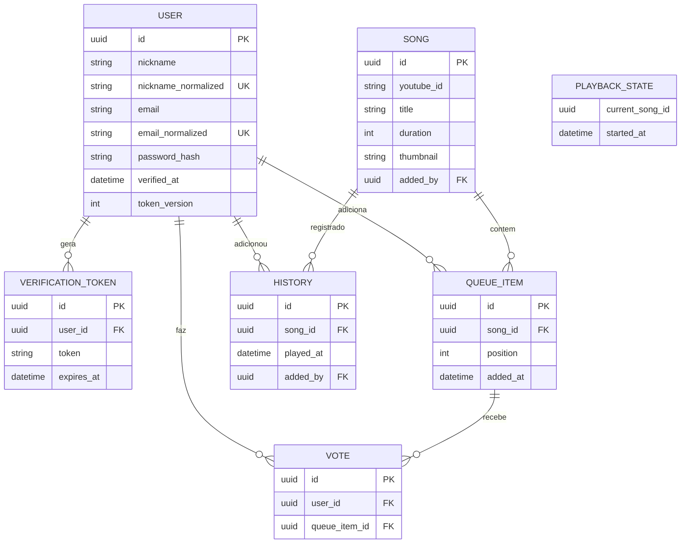

# SPEC.md

Especificação do sistema Rádio Comunitária.

## Histórias de usuário

- Como ouvinte, quero me cadastrar com apelido, e-mail e senha para ter acesso à rádio.
- Como ouvinte, quero confirmar meu e-mail pelo link de verificação para poder entrar.
- Como ouvinte, quero entrar com apelido **ou** e-mail + senha.
- Como ouvinte, quero buscar músicas no YouTube e adicioná-las à fila (máx. 3 por pessoa).
- Como ouvinte, quero ver a fila e o "tocando agora" em tempo real, entrando na música no meio (como rádio real).
- Como ouvinte, quero votar para pular a música atual (um voto por música).
- Como ouvinte, quero mutar o som até a próxima música, ou até uma música escolhida da fila.
- Como ouvinte, quero ver o histórico do que tocou (música, quando e quem adicionou).

## Regras de negócio

Cada regra abaixo tem pelo menos um teste automatizado.

1. **Limite de fila:** cada pessoa pode ter no máximo **3 músicas** na fila ao mesmo tempo.
2. **Pular música:** a música pula quando **mais de 50%** dos ouvintes presentes na rádio votam.
3. **Repetição:** uma música não pode ser adicionada se estiver entre as **últimas 20** tocadas.
4. **Voto duplicado:** o mesmo ouvinte não pode votar duas vezes na mesma música (segundo voto não conta).
5. **Saída da rádio:** quem sai perde o voto; as músicas que ele adicionou **continuam na fila**.
6. **DJ automático:** quando a fila esvazia e há ouvintes, o DJ assume: sorteia **uma** música do histórico (as que já tocaram) sem repetir até todas terem sido tocadas, e toca. Ao terminar, volta a verificar a fila — se houver músicas adicionadas, toca-as; senão, sorteia outra do histórico. A fila nunca fica vazia enquanto houver ouvintes. Não usa o YouTube.
7. **Falha da YouTube API:** se a busca falhar, o sistema avisa e continua funcionando (não trava).
8. **Concorrência:** dois ouvintes adicionando ou votando ao mesmo tempo não podem corromper a fila (transação/lock).
9. **Senha:** mínimo 8 caracteres, com pelo menos 1 maiúscula, 1 minúscula, 1 número e 1 caractere especial.
10. **Unicidade:** apelido e e-mail são únicos. A unicidade usa o campo normalizado (`trim` + `lowercase`), então `Teste`, `tEste` e `teSte` são o mesmo valor no banco.
11. **Verificação de e-mail:** o login é bloqueado até o usuário confirmar o e-mail (token expira em 24h).
12. **Sessão:** JWT expira em 24h; revogação via `token_version` no logout ou na troca de senha.

## Modelo de dados

## Convenções de dados

- Todo campo usado em busca/unicidade tem duas colunas: `campo` (valor digitado, exibido no front) e `campo_normalized` (`trim` + `lowercase`, usado em busca e constraint UNIQUE).
- Identificadores são UUID; senhas armazenadas só como hash bcrypt.
- Músicas são deduplicadas por `youtube_id` (UNIQUE): a mesma música do YouTube nunca é
  armazenada duas vezes. A busca registra (upsert) as músicas retornadas; adicionar à fila
  apenas referencia o registro existente.
- `title` é apenas exibição e **não** é usado para unicidade (músicas diferentes podem ter o
  mesmo título). `youtube_id` é case-sensitive — apenas `trim`, sem `lowercase`.
